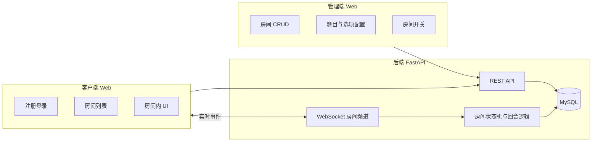
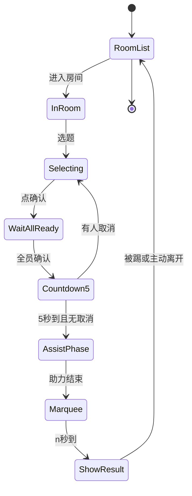
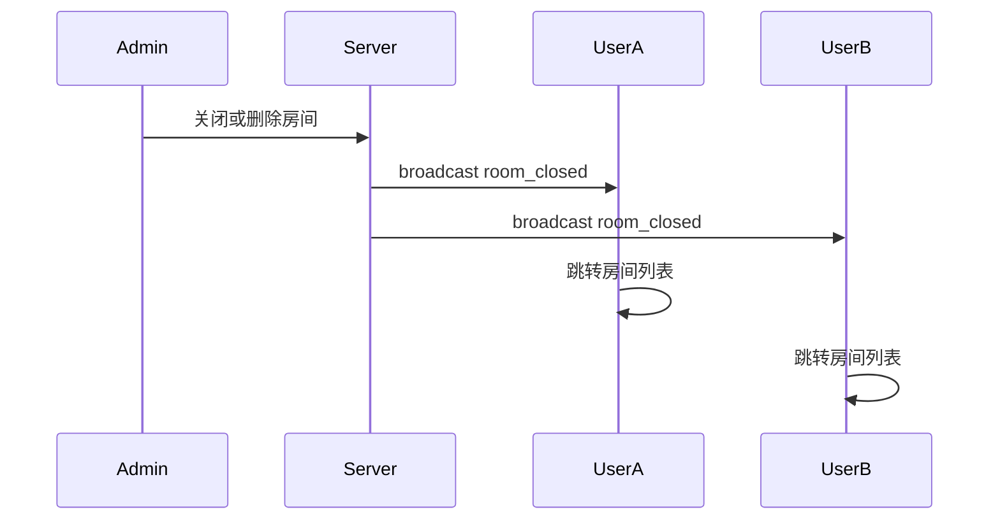
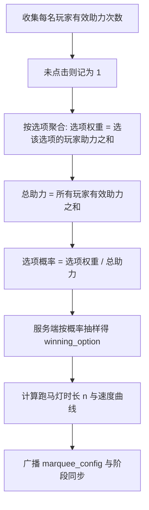
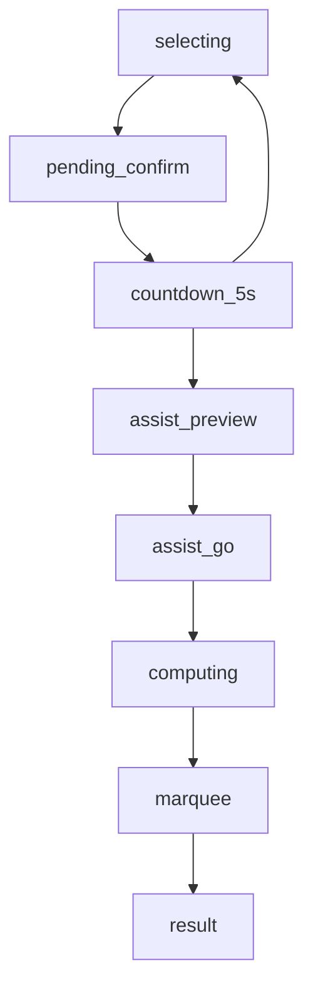

# 《大家来投票》项目设计文档

**版本**：1.2  
**依据**：[灵感.md](../灵感.md)（原始设想）  
**说明**：本文档在原始设想基础上统一术语、补齐规则边界、给出架构与算法可实现定义，作为开发、联调与测试的基准。流程图采用 Mermaid，可与支持 Mermaid 的 Markdown 预览器或 Wiki 同屏查看。

---

## 1. 项目概述

| 项 | 内容 |
|----|------|
| 名称 | 大家来投票 |
| 目标 | 解决「聚餐去哪」等群体决策，在公平投票基础上增加**随机性、同步感与娱乐性**（全员确认、助力、跑马灯）。 |
| 用户角色 | **管理员**：创建与配置房间、题目与选项，控制房间开关。**玩家**：注册登录后进入房间参与投票，同一时间仅允许处于一个房间内。 |

### 1.1 非目标（范围外）

以下不作为首版必须能力，可在后续迭代考虑：

- 高安全级别的防刷票、风控与审计体系。
- 复杂组织/角色权限模型（多管理员分级等）。

首版以**趣味、低摩擦、同步体验清晰**为主。

---

## 2. 系统架构

### 2.1 逻辑架构

### 2.2 职责划分

- **REST API**：注册、登录、房间列表、进入/离开房间等；可与 WebSocket 握手参数（如短期 Token）配合。
- **WebSocket**：房间内广播——欢迎/退出、阶段切换、倒计时同步、助力过程、跑马灯参数与结果等。
- **服务端权威**：选项展示顺序、当前阶段、各阶段倒计时起点、跑马灯**预设获胜选项**与动画调度参数均由服务端计算并下发；客户端仅负责展示与本地输入，避免多端不一致。

### 2.3 技术栈建议

| 层级 | 建议 |
|------|------|
| 后端 | Python 3、FastAPI、MySQL；密码哈希使用 bcrypt 或 Argon2。 |
| 实时 | WebSocket；消息体建议使用 JSON，并带 `msg_type` 与版本字段便于演进。 |
| 客户端 | **Vue 3 + TypeScript + Vite** 或 **React + TypeScript + Vite**；UI 组件库可选 Naive UI、Ant Design 等。 |
| 连接管理 | WebSocket 可用浏览器原生 API；若需自动重连与队列，可封装轻量客户端层（无需强制 Socket.IO，除非团队已有规范）。 |

---

## 3. 功能需求

### 3.1 管理端

**管理端鉴权**：创建房间时由服务端生成 **Admin Token**（建议仅创建成功时完整展示一次，或仅管理员本地保存）；后续所有管理端操作（房间 CRUD、题目与选项、开关房等）须在请求中携带该 Token（如 Header `X-Admin-Token`）。详见第 8 节与附录 A。

- **房间**：新建（房间名、人数上限）、列表、修改房间名、删除房间、设置房间为**未开启 / 开启**。仅**开启**的房间在客户端列表中可见（或按产品定义「可见但不可进」——推荐仅展示开启房间）。
- **房间内配置**：可添加若干**投票类型**（自定义名称，如「午饭餐厅」「游玩地」）。每个类型下配置 **2～10 个选项**；**盘子形 / 正方形** 展示样式**按投票类型统一配置**（同一类型下所有选项共用该样式，不按单个选项分别绑定）。
- **删除房间或关闭房间**：房间内所有在线玩家被**强制退出**到房间列表，并收到统一原因（房间已关闭 / 房间已删除）。

### 3.2 客户端（玩家）

- **注册**：邮箱、昵称、密码（不少于 6 位）；邮箱在系统内唯一。
- **登录**：失败时区分提示「账号不存在」与「密码错误」（与原始需求一致）。若后续有合规要求需弱化账号枚举，可再评估文案策略。
- **房间列表**：展示当前**开放中**的房间名称及**当前房内人数**。人数统计推荐以 **WebSocket 连接 + 心跳** 判定在线，避免仅 HTTP 进入但已断线仍计数。
- **单房间约束**：同一账号同时只能处于一个房间。进入新房时**自动离开**旧房；旧房内其他玩家收到飘屏类提示：`xxx 退出房间`。
- **房间内主界面（与原始设想一致）**：
  - **上方**：人型图标列表，上为昵称，下为状态（见 3.4）。
  - **中部**：当前投票类型的选项区（如盘子横向排列），选项文案由管理员配置。
  - **左下**：默认蓝色「确认」；确认后为红色「取消」（在允许取消的阶段可点）。
  - **右下**：黄色圆形 3D 风格「助力」按钮。

### 3.3 玩法与阶段（服务端状态机）

一轮投票建议抽象为下列**阶段**（名称可作代码常量，此处为语义说明）：

| 阶段 | 说明 |
|------|------|
| `waiting` | （可选）未满员或管理员尚未允许开始时停留。 |
| `selecting` | 玩家选择选项；**仅本人可见**自己选中高亮，他人不可见他人选择。 |
| `pending_confirm` | 玩家点击确认后等待全员确认；未全员确认前可保持「已选 + 已点确认」状态。 |
| `countdown_5s` | 全员已确认后，全员展示「所有玩家已确认」及 **5 秒同步倒计时**；此期间可点「取消」退回重新选择。 |
| `assist_preview` | 5 秒结束且无人再取消则锁定左下（灰色不可点）；中间弹窗 **助力倒计时 5 秒**。 |
| `assist_go` | 文案切换为「开始助力」，**10 秒**内可高频点击「助力」。 |
| `computing` | 服务端汇总选择、有效助力次数，计算权重、**预先抽样获胜选项**、计算跑马灯时长 `n` 与调度序列。 |
| `marquee` | **n 秒**跑马灯动画；全程按钮灰色不可点。 |
| `result` | 公布结果；与原始需求一致：**跑马灯结束后 1 秒**再弹窗展示最终结果。 |

**待产品细化（见附录 B）**：一轮结束后是否自动进入下一轮、管理员如何重置题目与清空状态。

### 3.4 玩家状态（展示用）

建议枚举：

- `selecting`：正在选择 / 未确认（或已选未确认，由 UI 区分）。
- `ready`：已确认且在等待全员或倒计时阶段（未取消）。
- `won`：本局投票结果与自己选择一致且本局规则判定为「胜」（与原始「获得本次投票胜利」对齐）。
- `lost`：本局未获胜（「遗憾失败」）。

具体「胜」的定义：与**最终停留选项**一致的玩家为胜；若多人同选同一获胜选项，可并列祝贺（原始文案「恭喜 xxx, yyy」支持多人）。

---

## 4. 核心流程图

### 4.1 玩家从进入到出局/结果（主流程）

### 4.2 管理员关闭或删除房间

### 4.3 助力、权重、抽样与跑马灯参数（数据流）

### 4.4 服务端阶段迁移（示意）

---

## 5. 算法说明

### 5.1 有效助力次数（每名玩家）

- 在 `assist_go` 的 10 秒内，若玩家**零次**点击「助力」，则有效助力记为 **1**。
- 若有点击，则有效助力为**实际点击次数**。
- 为防止异常刷屏，建议设**单玩家单局上限**（如 500 次/局），超出部分不计入权重（阈值可配置）。

### 5.2 选项权重与随机获胜选项（跑马灯前必须确定）

记玩家 \(p\) 选择的选项为 \(o_p\)，其有效助力为 \(a_p\)。

- 选项 \(k\) 的权重：\(W_k = \sum_{p:\, o_p = k} a_p\)。
- 总权重：\(W = \sum_k W_k\)。
- 选项 \(k\) 被抽中为最终结果的概率：\(P(k) = W_k / W\)（当 \(W=0\) 时不应进入本流程，见 5.5）。

**重要**：跑马灯仅为表现层；**在 `marquee` 阶段开始前**，服务端已完成对 `winning_option` 的抽样（可基于均匀随机数与累积概率实现 categorical 抽样）。

### 5.3 参与跑马灯的选项集合

- 界面**只保留至少有一名玩家选择过的选项**（与原始设想一致）。  
- 选项在客户端的**展示顺序**由服务端固定（例如按 `option_id` 升序），所有客户端必须使用同一顺序。

### 5.4 跑马灯总时长 n（秒）

令 \(T\) 为**全房间有效助力总次数之和**（每人至少计 1 次规则已体现在各 \(a_p\) 中）。

\[
n = \min(10,\ T)
\]

即：总次数小于 10 时，`n` 等于 \(T\)；大于等于 10 时，`n` 固定为 10 秒。与原始需求一致。

### 5.5 边界情况

- 若进入统计时**没有任何玩家选择任何选项**（\(W=0\)），本局不应进入 `assist_go` 之后阶段；应在产品层前置校验（例如全员必须选题并确认）或在 `computing` 前中止并提示管理员。具体策略在附录 B 中跟踪。

### 5.6 跑马灯速度曲线（可实现建议）

目标：

1. **在 `n` 固定时**，全房总助力次数越大，视觉上「跑得越快」（单位时间内高亮切换更频繁）。
2. 整体节奏为**渐慢**（ease-out），接近结束时明显减速，最终停在**已抽样的** `winning_option` 上。
3. 所有客户端按服务端下发的**时间表或步进序列**渲染，避免本地计时漂移导致终点不一致。

**实现思路（推荐）**：

- 服务端在 `winning_option` 确定后，生成在固定顺序列表上的**高亮索引序列** \(i_0, i_1, \ldots, i_N\)，其中最后一个索引对应获胜选项在列表中的位置。
- 总步数 \(N\) 可与 \(T\)（总助力）正相关；在区间 \([0, n]\) 秒内用单调递增的时间戳 \(t_j\) 安排每一步，且 \(t_j\) 的间隔采用 ease-out（例如基于 cubic 或指数缓动），使后半段间隔变大。
- 广播字段示例：`marquee_start_at`（服务器 UTC 时间）、`steps: [{ "t_ms": number, "highlight_index": number }]` 或压缩为等差序列 + 参数，由客户端插值（若带宽敏感）。

---

## 6. 数据模型（概要）

以下为逻辑表设计，实现时可按 ORM 调整命名。**管理端鉴权与展示样式字段语义**与附录 A 一致。

| 表 | 主要字段 | 说明 |
|----|----------|------|
| `users` | id, email, nickname, password_hash, created_at | email 唯一索引。 |
| `rooms` | id, name, max_players, status, admin_token_hash, created_at | status：`open` / `closed`；删除可用软删除或硬删除。**`admin_token_hash`**：创建房间时生成随机 Admin Token，仅保存哈希用于校验（与附录 A 一致）；删房即失效。 |
| `room_poll_types` | id, room_id, title, display_style, sort_order | **`display_style`**：必填，枚举 `plate` / `square`。样式**仅在本表按投票类型配置**（附录 A：同一类型下选项共用该样式）。 |
| `poll_options` | id, type_id, text, sort_order | 每类型 2～10 条。**不含**展示样式字段；客户端渲染时继承所属 `room_poll_types.display_style`。 |
| `room_memberships` | user_id, room_id, joined_at | 保证用户最多一条当前房间关系；换房时更新。 |
| `vote_rounds` | id, room_id, type_id, phase, phase_started_at, … | 一局/一轮状态机。 |
| `round_votes` | round_id, user_id, option_id | 玩家选择。 |
| `round_assists` | round_id, user_id, click_count | 助力统计；或仅记次数，由事件流汇总。 |

**索引建议**：`users.email` 唯一；`room_memberships.user_id` 唯一；`rooms.status` 便于列表筛选。

---

## 7. API 与 WebSocket 概要

### 7.1 REST（示例）

| 方法 | 路径 | 说明 |
|------|------|------|
| POST | `/auth/register` | 注册 |
| POST | `/auth/login` | 登录，返回客户端 Token |
| GET | `/rooms` | 开放房间列表（含人数） |
| POST | `/rooms/{id}/join` | 进入房间（触发离旧房） |
| POST | `/rooms/{id}/leave` | 主动离开 |

管理端 API **须**携带房间对应的 Admin Token，例如 `POST /admin/rooms`（Header: `X-Admin-Token`）及后续 `.../rooms/{room_id}/...` 子资源；路径与鉴权细节在实现阶段可细化，但鉴权要求以附录 A 为准。

### 7.2 WebSocket 消息类型（示例）

| msg_type | 方向 | 说明 |
|----------|------|------|
| `welcome` | S→C | 某用户进入，飘屏欢迎文案 |
| `user_left` | S→C | 某用户离开（含被踢、主动换房） |
| `phase_changed` | S→C | 阶段变更、阶段参数 |
| `countdown` | S→C | 同步剩余秒数或 server_deadline |
| `assist_state` | S→C | 助力阶段进度（可选：全局计数展示） |
| `marquee_start` | S→C | 跑马灯参数与开始时间 |
| `round_result` | S→C | 胜负与祝贺文案 |
| `room_closed` | S→C | 房间不可用，客户端回列表 |

建议每条消息携带 `server_time`（ISO8601）或 `server_ts_ms`，便于客户端校正显示层。

---

## 8. 安全与非功能需求

- **管理端**：首版采用附录 A 已定稿方案——**创建房间时生成 Admin Token**，管理端请求必须携带有效 Token；无 Token 或 Token 不匹配则拒绝操作。
- **玩家密码**：必须使用慢哈希存储；传输使用 HTTPS（生产环境）。
- **客户端会话**：JWT（短有效期 + 刷新策略）或服务端 Session + Cookie（按部署形态选择）。
- **WebSocket**：建立连接后首条消息或查询参数携带**短期访问凭证**，服务端校验用户身份与房间权限。
- **可用性**：房间列表与房内人数应容忍断线；心跳超时后减少计数。

---

## 9. 交付物

- 本文档：`docs/项目设计文档.md`。
- 原始设想：[灵感.md](../灵感.md)。
- 后续可补充：OpenAPI 规范、WS 消息 JSON Schema、测试用例矩阵（阶段转换与边界）。

---

## 附录 A：已定稿产品决策（原推荐方案）

以下两项按此前「推荐」方案**正式采纳为需求**，开发实现须遵守。

| 项 | 已定稿要求 |
|----|------------|
| **管理端鉴权** | 创建房间时由服务端生成 **Admin Token**；管理端调用管理类 API 时须在 HTTP 头（如 `X-Admin-Token`）或等价机制中携带该 Token。Token 与房间一一对应；删房后 Token 失效。创建成功界面须向管理员明确展示 Token 的保存方式（如仅一次完整展示 + 提示复制）。 |
| **盘子 / 正方形样式** | 展示样式**按投票类型（poll type）统一绑定**：同一类型下全部选项使用同一套样式（盘子或正方形），**不支持**按单个选项分别指定样式。 |

---

## 附录 B：后续产品细化

- 一轮投票结束后，是否自动开始下一轮，或需管理员手动「开始」。
- 管理员重置题目、清空玩家状态时，客户端与服务端数据如何版本化。
- 登录错误提示是否在后续版本改为统一模糊文案以兼顾安全与体验。
